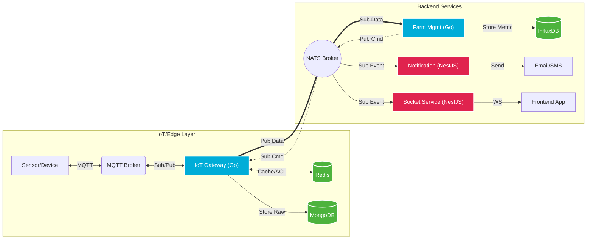

```mermaid
graph LR
    subgraph Edge ["IoT/Edge Layer"]
        Device["Sensor/Device"] <-->|MQTT| Broker("MQTT Broker")
        Broker <-->|Sub/Pub| Gateway["IoT Gateway (Go)"]
        Gateway <-->|Cache/ACL| Redis[("Redis")]
        Gateway -->|Store Raw| Mongo[("MongoDB")]
    end

    Gateway ==>|Pub Data| NATS(("NATS Broker"))
    NATS -.->|Sub Cmd| Gateway

    subgraph Backend ["Backend Services"]
        NATS ==>|Sub Data| Farm["Farm Mgmt (Go)"]
        Farm -.->|Pub Cmd| NATS
        Farm -->|Store Metric| Influx[("InfluxDB")]
        
        NATS -->|Sub Event| Noti["Notification (NestJS)"]
        Noti -->|Send| Email["Email/SMS"]
        
        NATS -->|Sub Event| Socket["Socket Service (NestJS)"]
        Socket -->|WS| FE["Frontend App"]
    end
    
    classDef go fill:#00ADD8,stroke:#fff,stroke-width:2px,color:white;
    classDef js fill:#E0234E,stroke:#fff,stroke-width:2px,color:white;
    classDef db fill:#4DB33D,stroke:#fff,stroke-width:2px,color:white;
    
    class Gateway,Farm go;
    class Noti,Socket js;
    class Redis,Mongo,Influx db;
```
